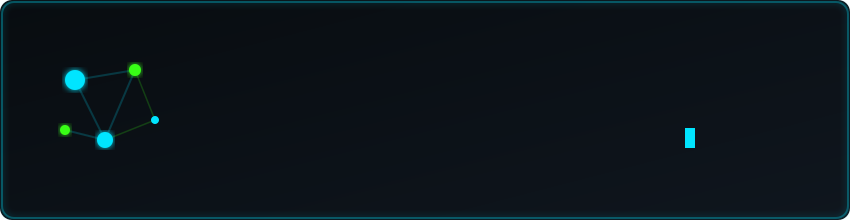

<div align="center">

# 🌌 Shitanshu Chaurasiya
### Data Science, Machine Learning & Full-Stack AI Engineer | IIT Madras BS

[](https://www.linkedin.com/in/shitanshu-chaurasiya-417009339)
[](https://huggingface.co/Shitanshu06)
[](https://www.kaggle.com)
[](mailto:24f2006167@ds.study.iitm.ac.in)

<br/>



<br/>


</div>

<br/>

---

### 👤 About Me

<table>
<tr>
<td width="50%" valign="top" align="center">

**🖥️ Terminal ASCII Portrait**

<br/>


</td>
<td width="50%" valign="top">

```
┌──────────────────────────────────────┐
│  shitanshu@dev-machine               │
│  ────────────────────────            │
│  OS: IIT Madras BS in Data Science   │
│  Focus: Full-Stack AI / ML / NLP     │
│  Lang: Python, TypeScript, SQL, C++  │
│  Backend: FastAPI, PostgreSQL, Redis │
│  Frontend: Next.js 14/16, React 19   │
│  ML: PyTorch, Transformers, LLMs     │
│  DevOps: Docker, GitHub Actions, CI  │
└──────────────────────────────────────┘
```

#### ⚡ Quick Highlights
- 🎓 **Education**: IIT Madras — BS in Data Science & Applications
- 🎯 **Flagship AI Project**: **[JobFit AI](https://jobfit-ai-gilt.vercel.app)** — Live Resume-to-Job Matcher & 4-Pillar ATS Diagnostic Engine (0–100)
- 🚀 **Flagship Platform**: **[Nexvora](https://career-platform-backend.vercel.app)** — End-to-End AI Developer Career & 1,000+ Problem Practice Suite
- 🧠 **AI & Machine Learning**: Fine-tuning transformer architectures (DeBERTa-v3, RoBERTa) & building interactive Hugging Face Spaces
- 🛠️ **System Architecture**: High-scale REST APIs, PostgreSQL schemas, real-time code judge sandboxes, and cloud edge proxies

</td>
</tr>
</table>

<br/>

---

### 📌 Featured Live Applications & Projects

| Project | Description | Working App & GitHub Repository |
|---|---|---|
| 🎯 **[JobFit AI — Resume Matcher & ATS Engine](https://jobfit-ai-gilt.vercel.app)** | AI resume matching engine with Hybrid RRF (BM25 + Dense Vector Search), 4-Pillar ATS Scanner (0–100), Google XYZ bullet enhancer & gap explainability | [](https://jobfit-ai-gilt.vercel.app) [](https://github.com/24f2006167/jobfit-ai) <br/> `Next.js 14`, `FastAPI`, `BM25`, `pgvector`, `Redis`, `Docker` |
| 🚀 **[Nexvora Career Platform](https://career-platform-backend.vercel.app)** | AI-powered developer career platform with 1,000+ coding problem judge, 34-day DSA curriculum, 6 role roadmaps, and mock interview suite | [](https://career-platform-backend.vercel.app) [](https://github.com/24f2006167/career-platform-backend) <br/> `Next.js 16`, `React 19`, `FastAPI`, `PostgreSQL`, `Monaco` |
| 🧠 **[Smart MCQ Solver (DeBERTa-v3)](https://huggingface.co/spaces/Shitanshu06/smart-mcq-solver)** | Live interactive multi-model MCQ solver with contextual reasoning powered by fine-tuned PyTorch DeBERTa-v3-large | [](https://huggingface.co/spaces/Shitanshu06/smart-mcq-solver) [](https://github.com/24f2006167/Smart-MCQ-Solver-DeBERTa) <br/> `PyTorch`, `Transformers`, `Gradio`, `DeBERTa-v3` |
| 🕹️ **[STS Arcade Points Tracker](https://googlearcadepointscalculator.vercel.app)** | Google Skills Arcade progress visualizer with a 3D hex-node globe hero section | [](https://googlearcadepointscalculator.vercel.app) [](https://github.com/24f2006167/Arcade-Tracker) <br/> `Next.js`, `Supabase`, `React Three Fiber`, `Three.js` |

<br/>

---

### 🛠️ Tech Stack & Skills

<div align="center">

| Domain | Technologies |
|---|---|
| **Languages** |  |
| **Backend & Databases** |  |
| **Frontend Frameworks** |  |
| **Data Science & ML** |   |
| **DevOps & Tools** |  |

</div>

<br/>

---

### 📊 GitHub Analytics

<p align="center">
  
  
</p>

<p align="center">
  
</p>

<div align="center">
  
</div>

<br/>

---

### 🎮 Contribution Arcade

<p align="center">
  
</p>

<br/>

<div align="center">
<sub>Designed & Maintained by Shitanshu Chaurasiya • Updated August 2026 🚀</sub>
</div>
